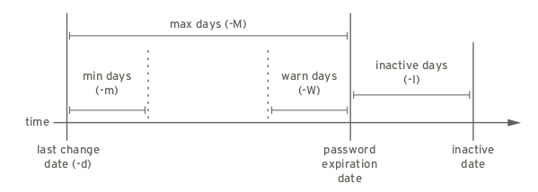

# SUDO

all commands executed using sudo are logged by default to **/var/log/secure**

# YUM

```
subscription-manager repos --disable '*' --enable=rhel-7-server-rpms
subscription-manager repos --enable rhel-7-server-optional-rpms
subscription-manager repos --enable rhel-7-server-extras-rpms
yum group install "Development Tools" --setopt=group_package_types=mandatory,default,optional
```

# Locale

> localectl list-keymaps

> localectl set-keymap map

# Users and groups

## useradd

## userdel

When a user is removed with userdel without the -r option specified, the system will have files that are owned by an unassigned user ID number.

## usermod

```
usermod --lock/-L or --unlock/-U
usermod --append/-a --groups/-G second_group --comment/-c
usermod -s /sbin/nologin student
```

## chage


```
chage -m 0 -M 90 -W 7 -I 14 username
chage -d 0 username will force a password update on next login.
chage -l username will list a username's current settings.
chage -E YYYY-MM-DD username will expire an account on a specific day.
```

## Groups
```
sudo groupadd -g 5000 ateam
sudo groupmod -g 6000 ateam
sudo groupdel ateam
```

# File permissions

**chmod**

* Who is u, g, o, a (for user, group, other, all)
* What is +, -, = (for add, remove, set exactly)
* Which is r, w, x (for read, write, execute)
* OR numeric is sum of r=4, w=2, and x=1.


**FACL**

```
setfacl -b appdir/                 # removes all acl's from directory
setfacl -m g:testusers:r appdir/   # testusers group to have read access to all files in the appdir
setfacl -Rm g:testusers:r appdir/  # recursive
setfacl -m u:testuser1:rwx appdir/ # Set testuser1 to have read, write and execute access to the appuser1 directory
setfacl -m o::rwx shared           # Set all users to have read, write and execute to the shared directory
```              

# SSH

```
ssh-keygen -t rsa -b 4192 -C "comment"
ssh-copy-id -i ~/.ssh/id_rsa.pub root@serverX.example.com
```

```
eval "$(ssh-agent -s)"
ssh-add ~/.ssh/id_rsa
```

# Logging

> systemctl list-unit-files --all   # list units

> journalctl -l -f

> journalctl --since "2015-06-26 23:15:00" --until "2015-06-26 23:20:00"

> journalctl --since "2 days ago"

by unit

> journalctl -u mysql.service -u sshd.service

follow new messages (combined with -u)

> journalctl -u mysql.service -f

# LVM

* Install lvm2
* List all the volumes using lsblk
* create physical volumes
```
/sbin/pvcreate <volume from prev list>
```
* then to list the volumes use /sbin/lvmdiskscan
* Create a volume group /sbin/vgcreate <name> /dev/vdb
* Format the vg 
```
/sbin/mkfs.ext4 /dev/mapper/Vol_group
```
* change fstab if you want to map this vg to some filesystem

/dev/mapper/vg /var/lib/folder ext4 rw,user 

* mount the volume using mount -a

# SELINUX

The restorecon command is part of the policycoreutil package, and semanage is part of
the policycoreutil-python package.

The **restorecon command is the preferred method** for changing the SELinux context of a file or
directory. **Unlike chcon**, the context is not explicitly specified when using this command. It uses
rules in the SELinux policy to determine what the context of the file should be.

**In most cases, running restorecon will correct the issue.**

For existing files
```
cp /tmp/file2 /var/www/html/
[root@serverX ~]# ls -Z /var/www/html/file*
-rw-r--r--. root root unconfined_u:object_r:user_tmp_t:s0 /var/www/html/file1
-rw-r--r--. root root unconfined_u:object_r:httpd_sys_content_t:s0 /var/www/
html/file2
[root@serverX ~]# semanage fcontext -l
... 
/var/www(/.*)? all files  system_u:object_r:httpd_sys_content_t:s0  
[root@serverX ~]# semanage fcontext -l
...
/var/www(/.*)?  all files  system_u:object_r:httpd_sys_content_t:s0
...
[root@serverX ~]# restorecon -Rv /var/www/
restorecon reset /var/www/html/file1 context
```
and for new folders/files
```
semanage fcontext -a -t httpd_sys_content_t '/custom(/.*)?'
restorecon -Rv /custom
```

## Ports

```
# semanage port -l | grep -w http_port_t
http_port_t                    tcp      80, 81, 443, 488, 8008, 8009, 8443, 9000
```

to open port

> semanage port -a -t http_port_t -p tcp 8001

to remove port

> semanage port -d -t http_port_t -p tcp 8001

## Set domain permissive

```
semanage permissive -a httpd_t
semanage permissive -d httpd_t
```

## Troubleshoot

Is logging running?

```
systemctl enable auditd.service
systemctl enable rsyslog.service
```

When SELinux denies an action, an Access Vector Cache (AVC) message is logged to the /var/log/audit/audit.log

```
tail /var/log/audit/audit.log
ausearch -m AVC,USER_AVC -ts recent
journalctl -t setroubleshoot --since=14:20
```

## MLS

> semanage login --modify --range s2:c100 john

# NETWORK

## IP

## NMCLI

```
nmcli dev status
DEVICE      TYPE      STATE        CONNECTION 
enp0s31f6   ethernet  connected    enp0s31f6  
virbr0      bridge    connected    virbr0     
vnet0       tun       connected    vnet0      
vnet2       tun       connected    vnet2      
enp11s0u1   ethernet  unavailable  --         
wlp61s0     wifi      unavailable  --         
lo          loopback  unmanaged    --         
virbr0-nic  tun       unmanaged    -- 
```

```
nmcli con show
NAME                UUID                                  TYPE      DEVICE    
enp0s31f6           9e1f6a3d-bea7-36c8-a0a6-dcd686f9962d  ethernet  enp0s31f6 
virbr0              0839d104-c666-4c7a-a36c-7bf5531f5039  bridge    virbr0    
vnet0               cfce338d-d2c8-4b51-9078-77f5e2cb7627  tun       vnet0     
vnet2               72ed9153-fe0e-40c5-9d32-0a246233c080  tun       vnet2     
Amsterdam (AMS2)    7b487c5c-09c9-4c4c-95b0-e562c4a5ad43  vpn       --     
```

**add connection**

DHCP

```
nmcli con add con-name eno2 type ethernet ifname eno2
```
> where configuration will be saved in /etc/sysconfig/network-scripts/ifcfg-eno2 because the con-name is eno2

or STATIC

```
nmcli con add con-name eno2 type ethernet ifname eno2 ip4 192.168.0.5/24 gw4 192.168.0.254
```

**activate or disable connection**

> nmcli con up static-eth0

> nmcli dev dis eth0

**check out details**

```
nmcli con show enp0s31f6
connection.id:                          enp0s31f6
connection.uuid:                        9e1f6a3d-bea7-36c8-a0a6-dcd686f9962d
connection.stable-id:                   --
connection.type:                        802-3-ethernet
connection.interface-name:              enp0s31f6
connection.autoconnect:                 yes
connection.autoconnect-priority:        -999
connection.autoconnect-retries:         -1 (default)
connection.auth-retries:                -1
connection.timestamp:                   1553763614
connection.read-only:                   no
connection.permissions:                 --
connection.zone:                        --
connection.master:                      --
connection.slave-type:                  --
connection.autoconnect-slaves:          -1 (default)
connection.secondaries:                 --
connection.gateway-ping-timeout:        0
connection.metered:                     unknown
connection.lldp:                        default
connection.mdns:                        -1 (default)
802-3-ethernet.port:                    --
802-3-ethernet.speed:                   0
802-3-ethernet.duplex:                  --
802-3-ethernet.auto-negotiate:          no
802-3-ethernet.mac-address:             --
802-3-ethernet.cloned-mac-address:      --
802-3-ethernet.generate-mac-address-mask:--
802-3-ethernet.mac-address-blacklist:   --
802-3-ethernet.mtu:                     auto
802-3-ethernet.s390-subchannels:        --
802-3-ethernet.s390-nettype:            --
802-3-ethernet.s390-options:            --
802-3-ethernet.wake-on-lan:             default
802-3-ethernet.wake-on-lan-password:    --
ipv4.method:                            auto
ipv4.dns:                               --
ipv4.dns-search:                        --
ipv4.dns-options:                       ""
ipv4.dns-priority:                      0
ipv4.addresses:                         --
ipv4.gateway:                           --
ipv4.routes:                            --
ipv4.route-metric:                      -1
ipv4.route-table:                       0 (unspec)
ipv4.ignore-auto-routes:                no
ipv4.ignore-auto-dns:                   no
ipv4.dhcp-client-id:                    --
ipv4.dhcp-timeout:                      0 (default)
ipv4.dhcp-send-hostname:                yes
ipv4.dhcp-hostname:                     --
ipv4.dhcp-fqdn:                         --
ipv4.never-default:                     no
ipv4.may-fail:                          yes
ipv4.dad-timeout:                       -1 (default)
ipv6.method:                            auto
ipv6.dns:                               --
ipv6.dns-search:                        --
```

and change it to static

```
nmcli con mod static-eth0 ipv4.addresses "192.0.2.2/24 192.0.2.254" ipv4.method "manual"
```

for **ipv6**

> nmcli con add con-name eno2 type ethernet ifname eno2 \
> ip6 2001:db8:0:1::c000:207/64 gw6 2001:db8:0:1::1 ip4 192.0.2.7/24 gw4 192.0.2.1

and DNS

> nmcli con mod static-eth0 +ipv6.dns 2001:4860:4860::8888

```
Remember that the file /etc/sysconfig/network-scripts/ifcfg-name can be directly
edited, and that nmcli con reload must be run after saving so that NetworkManager reads
the configuration changes.
```

# Hostname

> hostnamectl set-hostname demo.example.com

# FIREWALL

## Zones

|Zone name| Default configuration                                                           |
|---------|---------------------------------------------------------------------------------|
|internal |Reject incoming traffic unless related to outgoing traffic or matching the **ssh, mdns, ipp-client, samba-client, or dhcpv6-client** predefined services (same as the home zone to start with). |
|work |Reject incoming traffic unless related to outgoing traffic or matching the **ssh, ipp-client, or dhcpv6-client** predefined services. |
|public |Reject incoming traffic unless related to outgoing traffic or matching the **ssh or dhcpv6-client** predefined services. *The default zone for newly added network interfaces.*|
|external |Reject incoming traffic unless related to outgoing traffic or matching the **ssh** predefined service. Outgoing IPv4 traffic forwarded through this zone is masqueraded to look like it originated from the IPv4 address of the outgoing network interface.|
|dmz |Reject incoming traffic unless related to outgoing traffic or matching the **ssh** predefined service.|
|block |Reject all incoming traffic unless related to outgoing traffic.|
|drop |Drop all incoming traffic unless related to outgoing traffic (do not even respond with ICMP errors).|

## Masquerade

```
$ sudo firewall-cmd --zone=public --add-masquerade
$ sudo firewall-cmd --zone=public --add-forward-port=port=443:proto=tcp:toport=443:toaddr=192.168.2.42 --permanent
```

and 

```
$ sudo firewall-cmd --zone=public --remove-masquerade
$ firewall-cmd --zone=public --remove-forward-port=port=443:proto=tcp:toport=443:toaddr=192.168.2.42 --permanent
```

## Rich rules

```
[root@serverX ~]# firewall-cmd --direct --permanent --add-chain ipv4 raw blacklist
[root@serverX ~]# firewall-cmd --direct --permanent --add-rule ipv4 raw PREROUTING 0 -s 192.168.0.0/24 -j blacklist
[root@serverX ~]# firewall-cmd --direct --permanent --add-rule ipv4 raw blacklist 0 -m limit --limit 1/min -j LOG --log-prefix "blacklisted "
[root@serverX ~]# firewall-cmd --direct --permanent --add-rule ipv4 raw blacklist 1 -j DROP
```

TODO: check
> firewall-cmd --add-rich-rule='rule family=ipv4 source address=10.20.0.0/16 port port=1234 protocol=tcp log prefix="MyTagHere " level=info accept'

To verify new rules, run:

> $ sudo firewall-cmd --list-rich-rules --permanent

> firewall-cmd --permanent --direct --add-rule ipv4 mangle OUTPUT 0 -d 10.1.2.3/32 -j DSCP --set-dscp-class AF21

# DNS

> nslookup should be obsolete

The **host or dig** commands can be used to manually look up DNS names.

```
host -v -t A aroot-servers.net          #ipv4
host -v -t AAAA a.root-servers.net      #ipv6
```

# Time and NTP

## Time

```
timedatectl
systemctl restart systemd-timedated.service
timedatectl set-time HH:MM:SS
timedatectl set-time YYYY-MM-DD
timedatectl list-timezones | grep Europe
timedatectl set-timezone Europe/Prague
date +"%Y-%m-%d %H:%M"
date --set YYYY-MM-DD
date --set HH:MM:SS --utc
hwclock --set --date "21 Oct 2016 21:17" --utc
hwclock --systohc  OR  --hctosys
```

> To avoid problems with time zone and DST switching, it is recommended to keep the hardware clock in UTC.

## NTP

**chrony** should be prefered NTP for your system

> firewall-cmd --permanent --zone=public --add-port=123/udp

**driftfile** is name of the file where it can find and store the clock drift, also known as frequency error, of the system clock.

### chronyd

options in /etc/chrony.conf

> allow 192.0.2.0/24  # to allow only specific host/subnet/ipv6-host

> deny 192.1.2.0/24

> driftfile /myfile

> logdir /var/log/chrony

> local stratum 10

A large value of 10 indicates that the clock is so many hops away from a reference clock that its time is unreliable. If the computer ever has access to another computer which is ultimately synchronized to a reference clock, it will almost certainly be at a stratum less than 10. Therefore, the choice of a high value like 10 for the local command prevents the machine’s own time from ever being confused with real time, were it ever to leak out to clients that have visibility of real servers.

> log measurements statistics tracking

> makestep 1000 10

Normally chronyd will cause the system to gradually correct any time offset, by slowing down or speeding up the clock as required. In certain situations, the system clock may be so far adrift that this slewing process would take a very long time to correct the system clock. This directive forces chronyd to step system clock if the adjustment is larger than a threshold value, but only if there were no more clock updates since chronyd was started than a specified limit (a negative value can be used to disable the limit). This is particularly useful when using reference clock, because the initstepslew directive only works with NTP sources. This would step the system clock if the adjustment is larger than 1000 seconds, but only in the first ten clock updates.

TODO cleanup

### ntpd

options in /etc/ntp.conf

example: 

> restrict 192.168.1.0 mask 255.255.255.0 nomodify notrap

```
ignore — All packets will be ignored, including ntpq and ntpdc queries.
kod — a “Kiss-o'-death” packet is to be sent to reduce unwanted queries.
limited — do not respond to time service requests if the packet violates the rate limit default values or those specified by the discard command. ntpq and ntpdc queries are not affected. For more information on the discard command and the default values, see Section 18.17.2, “Configure Rate Limiting Access to an NTP Service”.
lowpriotrap — traps set by matching hosts to be low priority.
nomodify — prevents any changes to the configuration.
noquery — prevents ntpq and ntpdc queries, but not time queries, from being answered.
nopeer — prevents a peer association being formed.
noserve — deny all packets except ntpq and ntpdc queries.
notrap — prevents ntpdc control message protocol traps.
notrust — deny packets that are not cryptographically authenticated.
ntpport — modify the match algorithm to only apply the restriction if the source port is the standard NTP UDP port 123.
version — deny packets that do not match the current NTP version.
```


# SMTP


# HTTPD

> sudo yum -y install httpd httpd-manual

and see **/etc/httpd/conf/httpd.conf**

```
[root@serverX ~]# systemctl enable httpd.service
[root@serverX ~]# systemctl start httpd.service
[root@serverX ~]# firewall-cmd --permanent --add-service=http --add-service=https
[root@serverX ~]# firewall-cmd --reload
```

to see allowed ports

> semanage port -l | grep '^http_'

change context of new created DocumentRoot

> semanage fcontext -a -t httpd_sys_content_t '/new/location(/.*)?'

Allowing write access to a DocumentRoot

```
[root@serverX ~]# setfacl -R -m g:webmasters:rwX /var/www/html
[root@serverX ~]# setfacl -R -m d:g:webmasters:rwx /var/www/html
```
or for new folder
```
[root@serverX ~]# mkdir -p -m 2775 /new/docroot
[root@serverX ~]# chgrp webmasters /new/docroot
```

## TLS

> [student@serverX ~]$ sudo yum install httpd mod_ssl

> [root@serverX ~]# genkey <FQDN>


# Database

## MariaDB

## Postgres

### Official postgres way

```
yum install https://download.postgresql.org/pub/repos/yum/11/redhat/rhel-7-x86_64/pgdg-redhat11-11-2.noarch.rpm
yum install postgresql11
```

### Final steps

replace 10 with 11

```
/usr/pgsql-10/bin/postgresql-10-setup initdb
systemctl enable postgresql-10
systemctl start postgresql-10
```
